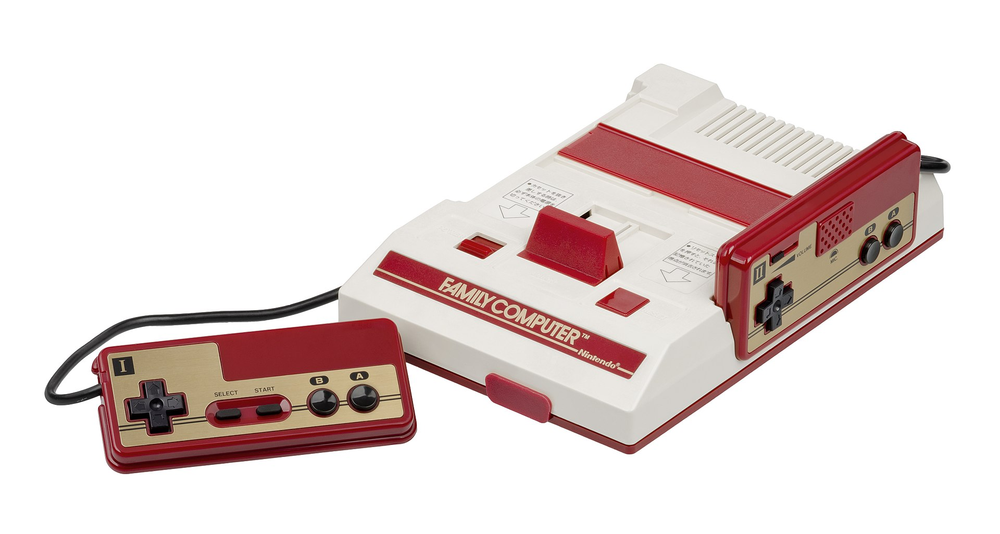
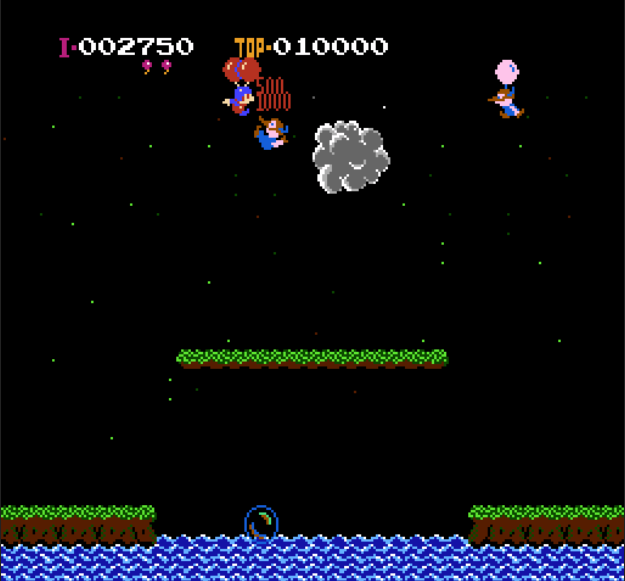

### 任天堂 Family Computer

&nbsp;&nbsp;在国内因为外观被称为红白机的任天堂FC(欧美版叫NES), 或者说Famicom(典型的日式英语缩写), 可谓是自己走向编程开发道路上不可缺少的一环. 可能有许多和我类似的因为玩上游戏, 就想开发一款自己的游戏, 而踏进这个圈子的(然后在开发的道路越走越远).

&nbsp;&nbsp;虽然这么说, 但是实际上玩的是国内生产的兼容机. 作为童年不可忽略的一环, 后有诗赞曰
> 小霸王骑了吴琼

### Re: FC模拟器
&nbsp;&nbsp;这里, 就让我记录FC开发模拟器部分细节, 也就是**Re: 从零开始的红白机模拟**.

&nbsp;&nbsp;其中在大学的时候, 用C++11做了一款FC的模拟器, 已经完整地模拟了CPU, 然后...就没有然后了. 不过这个项目了解到使用到的C++特性很少, 所以这里重新用C在做一次, 这一次当然是完整地模拟FC. 这也是标题Re: 的由来, 才不是Neta! 

这也是自己第一个核心用C写项目

### 从零开始
&nbsp;&nbsp;开局一款编译器, 代码全靠捡. 这系列博客属于笔记性质, 所以写得很详细方便以后查看. 也要求读者拥有基本的能力, 例如C, 多媒体之类的.

(笔者喜欢的一款FC(友尽)游戏-打气球)

### 硬件概述
直接摘选自wiki:
> FC使用一颗理光制造的8位2A03 NMOS处理器（基于6502中央处理器，但是缺乏BCD模式），PAL制式机型运行频率为1.773447MHz，NTSC制式机型运行频率为1.7897725MHz，主内存和显示内存为2KB。  
> FC使用理光开发的图像控制器（PPU），有 2KB 的视频内存，调色盘可显示 48 色及 5 个灰阶。一个画面可显示 64 个角色(sprites) ，角色格式为 8x8 或 8x16 个像素，一条扫描线最多显示 8 个角色，虽然可以超过此限制，但是会造成角色闪烁。背景仅能显示一个卷轴，画面分辨率为 256x240 ，但因为 NTSC 系统的限制，不能显示顶部及底部的 8 条扫描线，所以分辨率剩下 256x224。  
> 从体系结构上来说，FC有一个伪声音处理器 （pseudo-Audiom Processing Unit，pAPU），在实际硬件中，这个处理器是集成在2A03 NMOS处理器中的。pAPU内置了2个几乎一样（nearly-identical）的矩形波通道、1个三角波通道、1个噪声通道和1个音频采样回放通道（DCM，增量调制方式。其中3个模拟声道用于演奏乐音，1个杂音声道表现特殊声效（爆炸声、枪炮声等），音频采样回放通道则可以用来表现连续的背景音。

### 评论
仅仅2kb内存和2kb显存就能演绎出童年的色彩!
