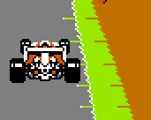

### 中精度同步

之前用的是非常暴力(?)的同步方法, 同步精度大致在帧, 自己称之为"低精度同步". 现在就要使用更加精确的同步了, 同步精度大致在扫描行, 自己称为"中精度同步". 还有最高的基于各个部件周期, 精度大致为次像素, 称为"高精度同步". 不过高精度同步会消耗较大的计算资源, 不在本博客范围内, 有兴趣的读者可以自行实现. 

在实现之前, 先看一下之前使用的一张图片:

之前提到了红框是当前的屏幕偏移量, 那有没有什么奇怪的地方?

 - [PPU scrolling](http://wiki.nesdev.com/w/index.php/PPU_scrolling)

就是左上角的分数显示! 因为直接显示这样分数会错位的. 这就是FC程序的小技巧, 屏幕刷新时写入VRAM指针. 大致时机可以分成两部分:

  1. 屏幕刷新
  2. 垂直空白

其中VBlank期间访问VRAM是合法, 而刷新时访问是不合法的. 但是可以利用写入\$2006(VRAM指针)这个制作出一些‘滚动’效果(或者\$2005, 但是PPU内部实现表明其实是一回事), 而真正的访问VRAM - \$2007(VRAM数据) 就太非法了, 模拟难度较高. 

一般利用这个实现之前提到的滚动方式, 被称为'分割滚动'(split-scrolling)

### 精灵命中与溢出
有这么两个标志位, 会在渲染中途才会被设置, VBlank结束后会清空. 这两个标志位一般来作为'分割滚动'的动作的转折点. 不过实际上溢出很少有游戏会使用(可能会浪费精灵).
所以一些游戏(比如[马里奥](https://retrocomputing.stackexchange.com/questions/1898/how-can-i-create-a-split-scroll-effect-in-an-nes-game)):
 1. 一直检测是不是命中了
 2. 命中了? 将水平滚动回复正常, 让下面的游戏背景可以滚起来. 
 3. VBlank期间再设置水平滚动为0让背景不滚

除了这两个还有通过硬件的IRQ(比如超级马里奥3, 状态栏在下面), 后面再说

### 相关内部寄存器
 - v: 当前VRAM (15位)指针
 - t: 临时VRAM (15位)指针, 可以认为是屏幕左上角的图块
 - x: 水平方向滚动微调 (3位)
 - w: 标记双写寄存器的写入次数 (1位)

VRAM指针(\$2006)在渲染时可被描述为:

位 | 描述
---|-----
0-4 | 水平偏移量, 以图块作为单位(8像素)
5-9 | 垂直偏移量, 以图块作为单位(8像素)
A-B | 名称表的索引($2000, $2400, $2800, $2C00)
C-E | 额外的(微调)垂直偏移量 像素(0-7)
F | 忽略

[PPU scrolling](http://wiki.nesdev.com/w/index.php/PPU_scrolling)中提到的这几个内部寄存器应该是PPU本身的内部实现, 但是我们不用太拘束, 只要理解每个位表示什么就行:
 1. (渲染时)\$2006的A-B位其实就是对应了\$2000(控制)的低2位. 
 2. (渲染时)\$2006的0-4位对应\$2005第一次写入的高5位, x寄存器对应\$2005第一次写入的低三位
 3. 垂直偏移量同理
 4. 只要程序猿不搞大新闻, 比如先写一次\$2005再写\$2006这种操作, 目前的实现还行, 以后可能会向官方内部的实现靠拢
 5. 垂直滚动的修改仅对下帧有效
 6. (剧透: 后面还是按照vtxw实现了, 官方实现太香了)

### 修改点
 0. 反汇编时读取指令长度
 1. 通过剖析, 发现READ操作消耗了近乎三分之一的CPU时间, 现在将读取指令区的操作单独实现了一份(目前是所有的寻址以及读取OpCode, 还有一个是立即寻址的操作, 有点难优化, 需要改一下OP宏的逻辑. 不过效率得到了明显的提升. )
 2. 指令模拟代码换成了强行内联, C99添加的inline效果不够给力, 只好用强行内联(__forceinline/\_\_attribute\_\_((always_inline))) 效率也得到了明显提升
 3. 分支语句没有执行跳转应该是消耗2周期
 4. Address should not increment on $2004 read
 - ROM 测试提出的, 不加就不加咯.
 5. DMA copy should start at value in $2003 and wrap
 - ROM 测试提出的, DMA复制需要换'行'处理
 6. Palette read should also read "underneath" VRAM into read buffer
 - ROM 测试提出的, 读取调色板会将处于下方调色板'下方'(减去\$1000)的VRAM读入伪缓存

### 同步
 我们先实现一个简单的模式来模拟一帧(场), 基于'同时只能显示25色'的假设(虽然可以在渲染时修改调色板以达到超过25色的可能), 也就是之前的实现差不多

[PPU rendering](http://wiki.nesdev.com/w/index.php/PPU_rendering)

根据说明, 我们可以这么实现:
 0. 开始前处理精灵溢出, 计算精灵会溢出的行数
 1. 0-239 行 可见扫描线 x240
 - 根据当前偏移渲染该行背景
 - 处理精灵#0的命中测试
 - 检测精灵溢出行
 - 让CPU执行一段时间
 - 结束后一次性渲染所有精灵
 2. 240 渲染后 x1
 - 让CPU执行一段时间
 2. 240-259行 垂直空白行 x20
 - 根据文档, 240是'渲染后'的扫描线, 但是目前不用管(同步率)
 - 开始后: 设置VBlank标志
 - 开始后: 看情况执行NMI
 - 开始后: 执行CPU执行一段时间
 - 结束后, 清除status所有状态
 3. 260-261 空行 x2 (或者1.5)
 - 执行CPU一段时间

 '执行CPU一段时间'是多久呢, 根据文档[Clock rate](https://wiki.nesdev.com/w/index.php/Clock_rate), NTSC的Master Clock是'21.477272 MHz', 除以60, 再除以 262.5大概是1364周期.
 CPU周期是Master的12分之一, 113.5. 为了避免小数, 我们用 Master Clock作为基准就行.

### 合在一起
现在就是把背景和精灵合在一起了, 看起来很简单, 但是画的时间非常多, 大概花了一个星期. 完成倒是很早就完成了, 完成后就是去通过ROM测试, 发现通过不了就再修改, 反反复复非常花时间.

### 细节
有些细节依然没有实现
- 什么, NTSC不能显示最上最下8像素啦
- 什么, \$2001除了D3, D4显示背景/精灵的使能位都没有实现啦
- 什么, 右边边界的精灵由于越界会写入一下行左边啦. 
- 太多了, 需要后期打磨

### SSE指令
 实现了之后, 自己用SSE处理了背景渲染的部分, 因为背景相对来说是对齐的, 就像数组那样, CPU使用明显降了不少. 而精灵部分没有, 没有对齐, 通过雪碧拉罐(spritecan)的ROM测试:
 

使用CPU剖析:

可以看出雪碧(sprite), 哦不, 精灵(sprite)的渲染占了整个核心的6%(1.28 / 20.37), 换句话说就算精灵渲染优化到0(效率提升无限倍), 也只有6%的核心提升, 全局甚至只有1%. 所以懒得优化了.

### F-1 Race
被誉为天才程序猿的岩田聪在FC上开发了一款伪3D赛车游戏 - F-1 Race. 目前模拟效果如下:

可以看出这个游戏是算准了CPU周期然后执行水平偏移实现的伪3D(大神就是能在处理游戏逻辑的同时掐准CPU周期写入偏移量). 也可以看出目前的同步率不够高(基于行, 一旦错过则该行错位), 看看以后能不能解决(比如一旦写入偏移则通知渲染层).

顺带一提这个游戏是分奇数帧和偶数帧的, 处理不当会导致画面闪烁.

> 岩田聪在奇数帧中更新转速(RPM), 偶数帧中更新距离(DIS)

