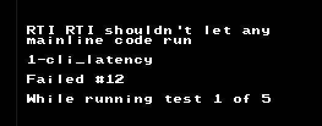
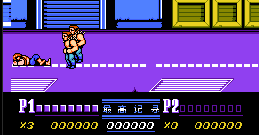

### STEP⑨: 实现部分Mapper

接下来进入本次的主角 Mapper004:

### Mapper004: [MMC3](https://wiki.nesdev.com/w/index.php/MMC3) - TxROM

MMC3 可谓是最开始几个Mapper中相当占分量的Mapper. MMC3是少数可以触发[IRQ](https://wiki.nesdev.com/w/index.php/IRQ)的Mapper之一.

MMC6也是用同一个mapper编号, 内部逻辑大致相同.

根据数据库,MMC3(在自己看来)比较有名的游戏, 比如:

 - 这就比较多了
 - 这次企划的主角: [Metal Max](http://bootgod.dyndns.org:7777/profile.php?id=3991)
 - 本次测试用的[双截龙2: 复仇](http://bootgod.dyndns.org:7777/profile.php?id=126)
 - [洛克人3](http://bootgod.dyndns.org:7777/profile.php?id=46), [4](http://bootgod.dyndns.org:7777/profile.php?id=35), [5](http://bootgod.dyndns.org:7777/profile.php?id=1114), [6](http://bootgod.dyndns.org:7777/profile.php?id=891)
 - [高桥名人的冒险岛2](http://bootgod.dyndns.org:7777/profile.php?id=269), [3](http://bootgod.dyndns.org:7777/profile.php?id=177)
 - 太多了

MMC3的IRQ最大的用处, 就是处理的分割滚动效果(状态栏在下面)

### IRQ 与 NMI区别
 - [NESDEV-IRQ](https://wiki.nesdev.com/w/index.php/IRQ)
 - IRQ需要在I标记为0(不要禁止中断)才能触发
 - 当然, IRQ NMI触发时都会自动标记I
 - IRQ一般输入为1, 表示不需要IRQ
 - 任何设备能使它为0, 表示不停地告诉CPU需要IRQ
 - 确认(acknowledge)IRQ能使它(输入)回到1(一般来说就是不需要IRQ)
 - IRQ处理程序必须确认IRQ, 否则会在返回主线代码时再次触发IRQ
 - 还有一些细节比如需要在CLI后再执行一个指令才会真正进入IRQ
 - 如果那一个指令恰好是RTI, 则balabala
 - 细节请参考测试ROM: cpu_interrupts_v2
 - 
 - 目前实现到第一个测试的测试12: "RTI RTI不允许执行主线代码" ... 我™... 这些测试ROM就是搞事
 - 本步骤自带的ROM就是这个"cpu_interrupts.nes"了

### Banks
 - CPU $6000-$7FFF: 8 KB PRG RAM bank
 - CPU $8000-$9FFF (or $C000-$DFFF): 8 KB switchable PRG ROM bank
 - CPU $A000-$BFFF: 8 KB switchable PRG ROM bank
 - CPU $C000-$DFFF (or $8000-$9FFF): 8 KB PRG ROM bank, fixed to the second-last bank
 - CPU $E000-$FFFF: 8 KB PRG ROM bank, fixed to the last bank
 - PPU $0000-$07FF (or $1000-$17FF): 2 KB switchable CHR bank
 - PPU $0800-$0FFF (or $1800-$1FFF): 2 KB switchable CHR bank
 - PPU $1000-$13FF (or $0000-$03FF): 1 KB switchable CHR bank
 - PPU $1400-$17FF (or $0400-$07FF): 1 KB switchable CHR bank
 - PPU $1800-$1BFF (or $0800-$0BFF): 1 KB switchable CHR bank
 - PPU $1C00-$1FFF (or $0C00-$0FFF): 1 KB switchable CHR bank
 - PRG切换的窗口是8KB
 - CHR切换的窗口是1KB
 - 是目前切换的最小窗口了, 如果还有更小的就需要重写了

### 寄存器
MMC3根据地址拥有4对寄存器

### Bank select ($8000-$9FFE, 偶数)
```
7  bit  0
---- ----
CPMx xRRR
|||   |||
|||   +++- Specify which bank register to update on next write to Bank Data register
|||        0: Select 2 KB CHR bank at PPU $0000-$07FF (or $1000-$17FF);
|||        1: Select 2 KB CHR bank at PPU $0800-$0FFF (or $1800-$1FFF);
|||        2: Select 1 KB CHR bank at PPU $1000-$13FF (or $0000-$03FF);
|||        3: Select 1 KB CHR bank at PPU $1400-$17FF (or $0400-$07FF);
|||        4: Select 1 KB CHR bank at PPU $1800-$1BFF (or $0800-$0BFF);
|||        5: Select 1 KB CHR bank at PPU $1C00-$1FFF (or $0C00-$0FFF);
|||        6: Select 8 KB PRG ROM bank at $8000-$9FFF (or $C000-$DFFF);
|||        7: Select 8 KB PRG ROM bank at $A000-$BFFF
||+------- Nothing on the MMC3, see MMC6
|+-------- PRG ROM bank mode (0: $8000-$9FFF swappable,
|                                $C000-$DFFF fixed to second-last bank;
|                             1: $C000-$DFFF swappable,
|                                $8000-$9FFF fixed to second-last bank)
+--------- CHR A12 inversion (0: two 2 KB banks at $0000-$0FFF,
                                 four 1 KB banks at $1000-$1FFF;
                              1: two 2 KB banks at $1000-$1FFF,
                                 four 1 KB banks at $0000-$0FFF)
```

MMC6 的M位是指是否使用PRG-RAM.

nesdev给出了详细的情况列表, 可以自行查看, 编码时直接抄就行了

### Bank data ($8001-$9FFF, 奇数)
```
7  bit  0
---- ----
DDDD DDDD
|||| ||||
++++-++++- New bank value, based on last value written to Bank select register (mentioned above)
```

### Mirroring ($A000-$BFFE, 偶数)
```
7  bit  0
---- ----
xxxx xxxM
        |
        +- Nametable mirroring (0: vertical; 1: horizontal)
```
这个就很简单了

### PRG RAM protect ($A001-$BFFF, 奇数)
```
7  bit  0
---- ----
RWXX xxxx
||||
||++------ Nothing on the MMC3, see MMC6
|+-------- Write protection (0: allow writes; 1: deny writes)
+--------- PRG RAM chip enable (0: disable; 1: enable)
```
PRG RAM保护..感觉没必要实现

### IRQ latch ($C000-$DFFE, 偶数)
IRQ了, 很重要的一环
```
7  bit  0
---- ----
DDDD DDDD
|||| ||||
++++-++++- IRQ latch value
```
IRQ闩锁, 用于指定一个重载值. 当计数器归零后, 计数器会重载这个值. 这个值会在每根扫描减少, 降至0就触发IRQ.

由于内部的原理是通过PPU巴拉巴拉, 所以要在背景精灵启动渲染才会触发倒计时, 否则运行超级马里奥3会程序会挂掉.


### IRQ reload ($C001-$DFFF, 奇数)
IRQ重载, 写入任意值会让计数器归0


### IRQ disable ($E000-$FFFE, 偶数)
IRQ禁止, 写入任意值标记禁止并且确认挂起的中断

### IRQ enable ($E001-$FFFF, 奇数)
IRQ使能, 写入任意值标记使能


### Mapper接口: 水平同步
这次功能就需要新的一个接口, 需要在每条扫描行进行一次同步, 我们就把它叫水平同步好了
```c
// 水平同步
void(*hsync)(sfc_famicom_t*);
```
由于目前的是EZ模式, 我们在每次可见扫描线结束后进行一次同步, 即水平同步. 计数器减到0就触发一次IRQ.

关于IRQ触发更为详细的细节请查看原文.

### 实现
本次的实现比较重要, 也明显比前面几个代码量更大.

[STEP9-MAPPER004.c](https://github.com/dustpg/StepFC/blob/master/step9/sfc_mapper_004_mmc3.c) 

### 结束?
本次先介绍的4种mapper就介绍完毕

项目地址[Github-StepFC-Step9](https://github.com/dustpg/StepFC/tree/master/step9)

### 作业
 - 基础: 文中提到了4个Mapper, 重新实现吧
 - 扩展: 试试实现其他Mapper!
 - 从零开始: 从零开始实现自己的模拟器吧

### 双截龙2: 复仇 模拟出现的问题
 - 这次CHR窗口的单位是1KB, 之前是用4KB的逻辑, 导致背景/精灵渲染出现问题
 - 
 - 第一次出现的可不是你啊, 是尖头发的
 - 这样自己发现了: 同屏只能有一种敌人. 小时候居然没有注意到
 - 由于NTSC是隐藏上下8条扫描线的, 很多游戏利用这一点用来更新图块


### 重装机兵模拟出现的问题
 - MM会在显示对话框的时候触发IRQ切换CHR-ROM BANK
 - 因为目前精灵显示并不是和同步的(方便以后用着色器渲染)
 - 导致渲染时用的是切换后的
 - 解决方案: 延迟精灵渲染到所有工作结束后(即开始新的一帧, MM会在VBlank时把BANK换回来)
 - 这种方案只能应急用, 这样又会导致菜单里面的东西出现问题:
 - 
 - 手指和菜单选择项渲染
 - 这种情况可以写专门对付的代码, 触发IRQ记录BANK
 - 或者精灵和背景同步渲染
 - 游戏愉快!

### REF
 - [NESDEV-IRQ](https://wiki.nesdev.com/w/index.php/IRQ)
 - [MMC3](https://wiki.nesdev.com/w/index.php/MMC3)