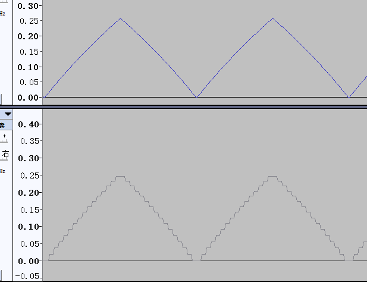
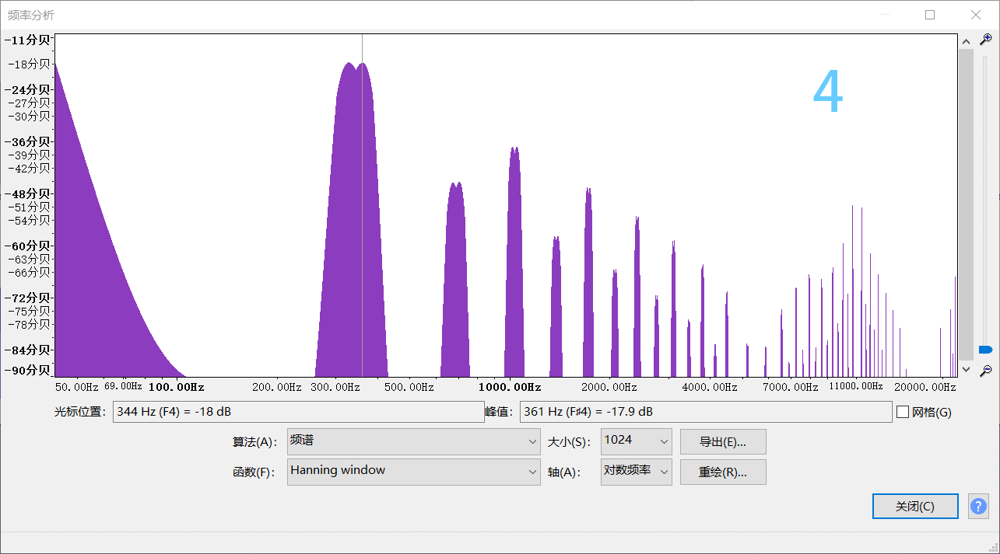
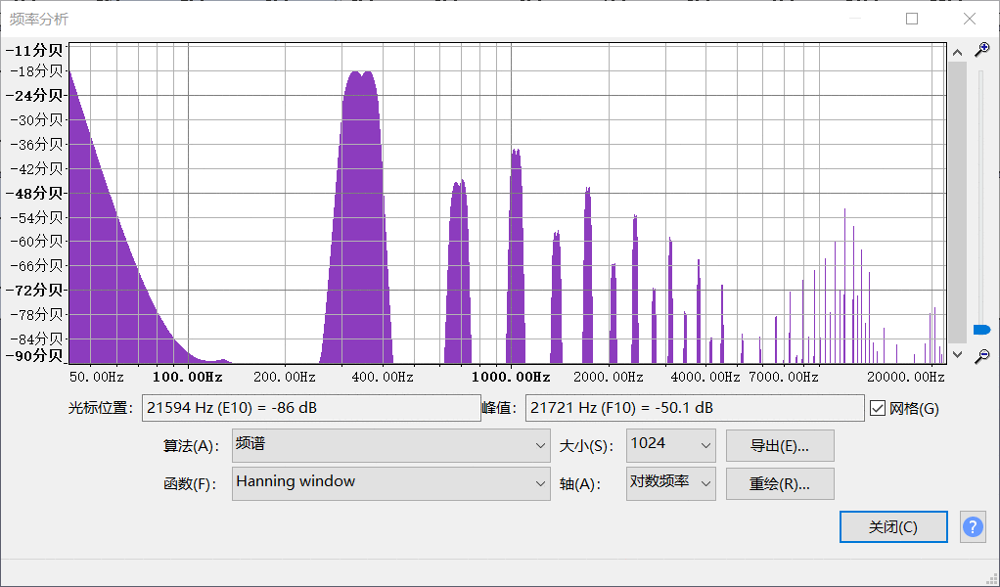

### 更多的算法
还有非常多的算法, 光维基那种对照图就还有LQx和xBR系列, 有机会的话再介绍吧.

下面就是音频的部分了, 不过再介绍滤波器之前, 先讨论一个问题, 我们加入这些额外处理部分是为了提升用户体验程度. 与视频部分不同的是, 我们能拿到音频更基础的信息. 就像第一个音频播放状态机一样, 我们能知道音频在某一刻的信息.

那我们能不能根据这些提高音质呢?

### 方波
这个没什么好说的, 不是0就是1.

### 三角波
这个就有的说了, 从之前的实现我们知道: FC的三角波实际上是一个伪三角波, 从0到15, 再通过混频. 可以看作是一个深度为4bit的(伪)三角波, 我们可以通过额外的处理来加深三角波的深度, 或者调整算法逼近真正的三角波.

那么问题来了, "音质"提高了吗? 让我们简单测试一下!

根据原版的混频算法:```159.79 / (1 / (triangle / 8227) + 100)```. 可以计算出最大的振幅是```0.246412```, 对应8bit的PCM值约```63```. 如果能线性增加, 这时候的频率大致是344Hz(```44100/(64*2)```), 63对应的是6bit, 那就对比344Hz下6bit和4bit的差距吧:

```c
void make_triwave() {
    float tri4[(1 << 4) * 2];
    float tri6[(1 << 6) * 2];
    // 4bit T-WAVE - A
    for (int i = 0; i != (1 << 4); ++i)
        tri4[i] = (1 << 4) - 1 - i;
    // 4bit T-WAVE - B
    for (int i = 0; i != (1 << 4); ++i)
        tri4[i + (1 << 4)] = i;
    // 6bit T-WAVE - A
    for (int i = 0; i != (1 << 6); ++i)
        tri6[i] = (1 << 6) - 1 - i;
    // 6bit T-WAVE - B
    for (int i = 0; i != (1 << 6); ++i)
        tri6[i + (1 << 6)] = i;

    FILE* const file1 = fopen("out1.raw", "wb");
    FILE* const file2 = fopen("out2.raw", "wb");
    if (!file1 || !file2) exit(1);

    
    float buf[(1 << 6) * 2];
    // 6bit WAVE
    for (int i = 0; i != (1 << 6) * 2; ++i) 
        buf[i] = 159.79f / (1.f / (tri6[i] / 4.f / 8227.f) + 100.f);
    for (int i = 0; i != 44100 * 5 / ((1 << 6) * 2); ++i)
        fwrite(buf, sizeof(buf), 1, file1);
    // 4bit WAVE
    for (int i = 0; i != (1 << 6) * 2; ++i)
        buf[i] = 159.79f / (1.f / (tri4[i/4] / 8227.f) + 100.f);
    for (int i = 0; i != 44100 * 5 / ((1 << 6) * 2); ++i)
        fwrite(buf, sizeof(buf), 1, file2);
    fclose(file1);
    fclose(file2);
    exit(0);
}
```

这样生成了在44.1kHz下344Hz的6bit深度和4bit深度的三角波, 我们导入音频软件可以得到:



听起来怎么样? emmmm...差不多...4bit版本听起来像是混了一段高频的噪音, 6bit版本混了一段稍微低频的噪音. 那就看看频谱分析:



似乎印证了自己的主观判断. 不过注意了, 6bit是之前让其线性增加计算得到的深度, 频谱图可以看出很接近真正的三角波了.


那么, "音质"提高了吗? 是, 也不是. 理论上, 你完全可以把三角波替换成钢琴音, 让模拟器发出钢琴的声音:


不过这完全是两个不同的东西! FC的伪三角波也一样, 和真正的三角波不是同一个东西, 我们可以调整算法让它逼近真的三角波, 也可以像上面那样提高深度. 但是, **有没有必要**?

那么, 如果要做的话, 深度最高是多少? 344Hz下用6bit的, 序列长128. 算下来, ```44100/1024 = 43.07```, 43Hz应该足够低了吧, 9bit, 1024序列. 再不济22Hz, 加倍而已.

### 噪音
噪声声道可以提高"音质"吗? 理论上可行, 因为之前了解到噪音实际上只有32种音色, 我们完全可以去找32种音质更好的样本即可. 

当然还有的方法是再发明一个伪随机算法, 不过难度很高.

### DMC
DMC声道呢, DMC用来播放样本数据, 我们不可能无成本的增加信息, 能做的最多就是降降噪什么的. 不过由于ΔPCM的特殊性, 只有1bit的Δ编码, 自己**猜测**应该可能通过样本分析, 还原出更好的PCM样本.


### 其他
方波虽然只有0和1, 但是通过一些手段还是能生成很不错的声音. 包络生成器, 扫描单元.

我们可以通过对ADSR的模拟让声音听起来更加自然点, 即ADSR包络模拟. 还有就是更加平滑的频率扫描.

由于目前的实现是: 处理上一个事件. 那么, 反而因为这个特殊性, 实现上述"增强音质"的手段更加简单! 如果按照周期实现反而不方便"预测".

### 滤波器
有针对视频的滤镜自然也就有针对音频的滤波器, 不过都叫"filter"罢了.

根据nesdev的记载, NES本身就搭载了滤波器:

 -  90Hz的一阶高通滤波器
 - 440Hz的一阶高通滤波器
 - 14kHz的一阶低通滤波器


### 低通滤波
由于看不懂电路图, 这里就假定是RC滤波器, 网上资料较多.

根据低通RC滤波可以得到离散RC低通滤波器用的式子:

```
           T                RC
Y(n) = ---------- X(n) + ---------Y(n−1)
         T + RC           T + RC

T: 采样周期
RC: 滤波时间
例如: R = 47(千欧), C = 220(皮法).
    有滤波时间 RC = 10.34(微秒)

    

截止频率(cut-off frequency)计算公式为:

         1
f0 = ----------
        2πRC

10.34(微秒)的截止频率大致就是15kHz.
```

联立, 用C描述就是:
```c
float input, output, prev_output;

float cutoff_frequency = 90;
float sample_frequency = 44100;
float PI = 3.1415926535897932384626433832795;

float RC = 1.f/2.f/PI/cutoff_frequency;
float k1 = 1.f/(1.f+RC*sample_frequency);
float k2 = 1.f - k1;

output = prev_output = input * k1 + prev_output * k2;

```


### 高通滤波
同样假定为RC滤波器.

根据高通RC滤波可以得到离散高通滤波器用的式子:

```
                                  RC
Y(n) = (X(n) - X(n-1) + Y(n-1)) ------
                                 RC+T


截止频率同为:

         1
f0 = ----------
        2πRC
```

联立, 用C描述就是:
```c
float input, output, prev_input, prev_output;

float cutoff_frequency = 14000;
float sample_frequency = 44100;
float PI = 3.1415926535897932384626433832795;

float RC = 1.f/2.f/PI/cutoff_frequency;
float k = RC/(RC + 1.f/sample_frequency);

output = (input - prev_input + prev_output) * k;

prev_input = input;
prev_output = output;

```

### 疗效如何?
拿之前的4bit的伪三角波来说, 整体音量都减少了, 高频噪音还是能听到. 那就就行频谱分析:



很明显低音部分几乎没了, 但是高频部分由于大部分在截止频率下面, 所以不大明显(14kHz太高了几乎听不见, 感觉就像是一个电路保险, 22kHz采样率还能听的情况下完全没用了).

NES是这样的, FC似乎就不同了, 详细的可以查看nesdev的说明, 所以感觉应该提供选项给用户关闭滤波.


### StepD: 滤镜与滤波器

那么正式进入这一步, 由于几乎是在末端修改的, 同上一步核心部分没有修改.

滤镜部分由于是在最末端的着色器实现的, 所以又升级了图像接口, 音频滤波是用CPU实现的, 所以音频接口没有修改.


图像接口:

 - "d2d_draw2.cpp" "d2d_draw2.h"
 - 由于GPL的原因, 并没有实现之前介绍的全部算法


项目地址[Github-StepFC-StepD](https://github.com/dustpg/StepFC/tree/master/stepd)


### 作业
 - 实现自己的滤镜/滤波器吧

### REF
 - [APU Mixer](http://wiki.nesdev.com/w/index.php/APU_Mixer)
 - [截止频率](https://zh.wikipedia.org/wiki/截止頻率)